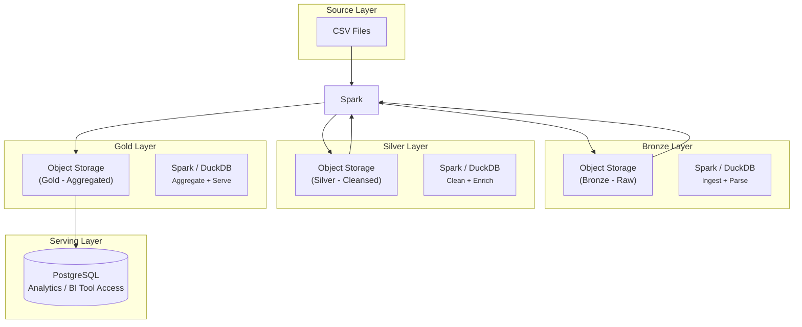

# Data Engineering POC - 1
This is my repository to learn data engineering tools. I have access to Linode's Spark Cluster, Object Storage and PostgreSQL instance so I will be utilizing these resources to learn how to ingest data from CSV to an object storage and then to PostgreSQL.

